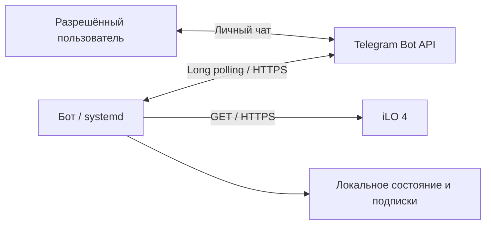

# iLO Telegram Bot

Telegram-бот для мониторинга оборудования HPE ProLiant через **iLO 4**. Русское меню,
показания датчиков и уведомления об изменении состояния. Работает на Python 3.10+
без сторонних библиотек; для постоянного запуска предусмотрена служба systemd.

Бот обращается к iLO только для чтения. Команд выключения, перезагрузки и изменения BIOS нет.

## Возможности

- Состояние сервера и аппаратные предупреждения.
- Температуры, пороги датчиков и скорость вентиляторов.
- Потребляемая мощность, состояние и показания блоков питания.
- Smart Array, логические диски RAID, физические диски и батарея кэша.
- Последние 15 событий Integrated Management Log (IML).
- Модель сервера, серийный номер, BIOS, процессоры и установленная память.
- Подписка на сообщения о неисправностях и восстановлении без повторения одинаковых тревог.
- Доступ по списку числовых Telegram ID, только в личных чатах.
- Redfish `/redfish/v1/` и совместимость со старым API `/rest/v1/`.
- Поддержка HTTP CONNECT прокси для подключения к Telegram.

Пример сводки с условными показаниями:

```text
HPE ProLiant
Опрос: 11.09.2026 12:00:00 МСК (15 с назад)

Сервер: включён
Общее состояние: ✅ исправно
Потребление: 135 Вт

Активных предупреждений в доступных данных iLO нет.
```

## Как это работает



По умолчанию бот опрашивает iLO каждые 60 секунд. Telegram-команды используют сохранённый
снимок показаний с временем опроса; журнал запрашивается отдельно. Устаревшие или частично
недоступные данные отмечаются явно.

После `/start` пользователь получает сводку и подписывается на уведомления. Изменение
аппаратного состояния вызывает сообщение. Недоступность iLO подтверждается тремя
неудачными опросами подряд. Бот запоминает доставленные уведомления, чтобы не повторять
их при каждом опросе и после перезапуска. При ошибке отправки он повторяет попытку.

## Требования

- Linux с systemd для запуска установленной службы; Python **3.10 или новее**.
- Доступ с машины бота к HTTPS-интерфейсу iLO и Telegram Bot API.
- iLO 4 с доступным REST/Redfish API и учётная запись для чтения нужных разделов.
- Токен Telegram-бота и числовые ID пользователей, которым разрешён доступ.
- Права `sudo` для установки службы.

Реальная интеграция проверена на **HPE ProLiant ML350 Gen9 с iLO 4 и Smart Array P440ar**,
Python 3.13.5. Наличие конкретных датчиков и полей зависит от оборудования и прошивки.
Windows подходит для запуска автоматических тестов; `install.sh` рассчитан на Linux.

## Быстрый старт

```sh
git clone https://github.com/SSChert228/ilo-telegram-bot.git
cd ilo-telegram-bot
umask 077
cp config.example.json config.json
```

Откройте `config.json` в редакторе и укажите свой токен, адрес и пароль iLO,
а также разрешённые Telegram ID. Пустой список `allowed_users` не позволяет запустить бот.

```json
{
  "telegram_token": "YOUR_BOT_TOKEN",
  "allowed_users": [6000000001, 6000000002],
  "ilo_url": "https://ilo.example.internal",
  "ilo_username": "monitoring",
  "ilo_password": "YOUR_ILO_PASSWORD",
  "ilo_cert_sha256": "",
  "server_name": "HPE ProLiant",
  "poll_seconds": 60,
  "failure_threshold": 3,
  "state_dir": "/var/lib/ilo-telegram-bot"
}
```

ID и адрес в примере вымышлены — замените их своими значениями. Токен и пароль хранятся
только в рабочем `config.json`; этот файл исключён из Git.

Проверьте код и доступность API, затем установите службу:

```sh
python3 -m unittest -v test_bot.py
python3 bot.py --config config.json --check
sudo sh install.sh
systemctl status ilo-telegram-bot --no-pager
```

`--check` читает iLO и проверяет Telegram через `getMe`/`getWebhookInfo`. Он не отправляет
сообщения и не читает очередь команд, поэтому подходит для диагностики работающей службы.
В ответе проверьте, что `webhook_present` равен `false`, а `sections_unavailable` пуст.

Установщик повторно выполняет тесты и проверку API, создаёт пользователя `ilo-bot`,
устанавливает конфигурацию и службу, включает автозапуск. После успешной установки
исходный `config.json` удаляется из каталога установки: рабочая копия остаётся в `/etc`.

Откройте своего бота в Telegram и отправьте `/start`. Каждый разрешённый пользователь,
которому нужны уведомления, должен сделать это в собственном личном чате.

## TLS и прокси

Если `ilo_cert_sha256` пуст, используется системная проверка TLS-сертификата.
Для самоподписанного сертификата укажите его заранее проверенный SHA-256 отпечаток:
64 шестнадцатеричных символа, допустимы разделители `:`.

При использовании отпечатка клиент сравнивает его **до отправки пароля**. Смена сертификата
останавливает чтение до обновления конфигурации. Ссылки на другой сервер и HTTP-редиректы
не допускаются. Отпечаток следует сверить по доверенному каналу с вашим iLO.

Для старого iLO с сертификатом RSA 1024 бит можно дополнительно задать
`"ilo_legacy_tls": true`. Этот режим применяется только вместе с точным отпечатком iLO.

Необязательный прокси Telegram:

```json
"telegram_proxy": "http://127.0.0.1:10809"
```

Если прокси не нужен, удалите этот параметр. Обращения к iLO выполняются напрямую.
Установка и настройка самого прокси в проект не входят.

## Команды

| Команда | Действие |
|---|---|
| `/start` | Сводка, клавиатура и включение уведомлений |
| `/status` | Общее состояние и активные предупреждения |
| `/temps` | Температуры установленных датчиков |
| `/fans` | Состояние и скорость вентиляторов |
| `/power` | Потребление и блоки питания |
| `/storage` | Контроллер, RAID, диски и батарея кэша |
| `/logs` | Последние 15 событий IML по времени создания/обновления |
| `/info` | Аппаратная конфигурация сервера |
| `/alerts` | Состояние подписки |
| `/alerts_on` | Включить уведомления |
| `/alerts_off` | Выключить уведомления, сохранив доступ к командам |
| `/stop` | То же, что `/alerts_off` |
| `/help` | Справка |

Основные команды доступны через русскую клавиатуру. Посторонние пользователи, группы,
каналы, анонимные, bot/inline/business-отправители игнорируются. Список разрешённых ID
задаётся в конфигурации. После его изменения перезапустите службу.

## Эксплуатация

| Путь | Содержимое |
|---|---|
| `/opt/homelab/bots/ilo-telegram-bot` | Установленный код |
| `/etc/ilo-telegram-bot/config.json` | Токен и настройки; `root:ilo-bot`, режим `0640` |
| `/var/lib/ilo-telegram-bot/state.json` | Снимок показаний, подписки и позиция очереди |
| `/etc/systemd/system/ilo-telegram-bot.service` | Служба systemd |

```sh
# Журнал и состояние службы
sudo journalctl -u ilo-telegram-bot -n 40 --no-pager
systemctl is-active ilo-telegram-bot
systemctl is-enabled ilo-telegram-bot

# Перезапуск после изменения конфигурации
sudo systemctl restart ilo-telegram-bot

# Проверка API без остановки службы
sudo -u ilo-bot python3 /opt/homelab/bots/ilo-telegram-bot/bot.py --check
```

Служба автоматически восстанавливается после аварийного завершения процесса. Работает
от отдельного пользователя с ограничениями systemd, без root и входящих сетевых портов.
На Linux файловая блокировка предотвращает второй запуск с тем же каталогом состояния.

Для обновления получите новый код через `git pull`, повторите тесты и подготовьте
`config.json` для установщика. Например, можно скопировать действующий конфигурационный
файл в каталог проекта с режимом `0600`, затем выполнить `sudo sh install.sh`.
Перед заменой конфигурации установщик сохраняет её предыдущую копию в `/etc` с режимом `0600`.

## Проверки

```sh
python3 -m unittest -v test_bot.py
```

В наборе **40 автоматических тестов**: права доступа, команды, старые форматы iLO,
ошибки и восстановление, повторная доставка, отсутствие дубликатов, перезапуск,
сохранение состояния, TLS, пагинация и лимиты Telegram. Они не требуют настоящего
токена или сервера и не отправляют сообщения. ID в тестах синтетические, в том числе
больше диапазона 32-битного целого.

Для отдельно согласованной проверки настоящей доставки выбранному разрешённому
подписчику предусмотрен сценарий:

```sh
sudo -u ilo-bot python3 /opt/homelab/bots/ilo-telegram-bot/integration_alert_test.py \
  --config /etc/ilo-telegram-bot/config.json \
  --chat-id YOUR_TELEGRAM_ID
```

Он отправляет **два сообщения с пометкой «ТЕСТ»**: смоделированный обрыв связи и
восстановление. Оборудование и рабочее состояние бота не меняются. Адресат должен
быть разрешён конфигурацией и уже подписан через `/start`.

При развёртывании также проверены реальные команды в Telegram, доставка двух тестовых
уведомлений, блокировка второго экземпляра и восстановление после SIGKILL.
Локальные отчёты и снимки настоящего оборудования в репозиторий не включены.

## Ограничения и диагностика

- **Бот на отслеживаемом сервере остановится вместе с ним.** Для сообщения о полном
  отключении питания запускайте наблюдателя на другом устройстве.
- iLO показывает оборудование, а не загрузку CPU/RAM операционной системы и не здоровье приложений.
- IML — история событий. Старые или уже устранённые записи не считаются текущей аварией;
  некорректные исторические даты часов iLO сохраняются как получены.
- Неподдерживаемые нулевые верхние температурные пороги не вызывают ложных тревог.
- Уровень RAID показывается буквально с пометкой «по iLO»; наличие подробностей зависит от контроллера.
- Время сводок сейчас отображается в МСК (UTC+3). Интервал и число ошибок настраиваются
  в конфигурации; справка `/help` описывает значения по умолчанию 60 секунд и 3 ошибки.
- Для одного токена нужен один polling-процесс. Webhook или ошибка Telegram `409`
  требуют проверки другого запуска бота; существующий webhook автоматически не удаляется.
- При отказе авторизации проверьте токен, учётные данные и права iLO. При недоступности
  раздела проверьте поддержку его API и доступность самого iLO.

## Файлы проекта

```text
bot.py                      Telegram, меню, мониторинг и сохранение состояния
ilo.py                      Чтение iLO, коллекции API и аппаратные предупреждения
config.example.json         Шаблон конфигурации без рабочих учётных данных
ilo-telegram-bot.service     Служба systemd
install.sh                  Установка и повторное развёртывание
test_bot.py                 Автоматические тесты
integration_alert_test.py   Проверка настоящей доставки тестовых уведомлений
README.md                   Документация
```

## Документация протоколов

- [Telegram Bot API](https://core.telegram.org/bots/api)
- [HPE iLO 4 RESTful API](https://hewlettpackard.github.io/ilo-rest-api-docs/ilo4/)
